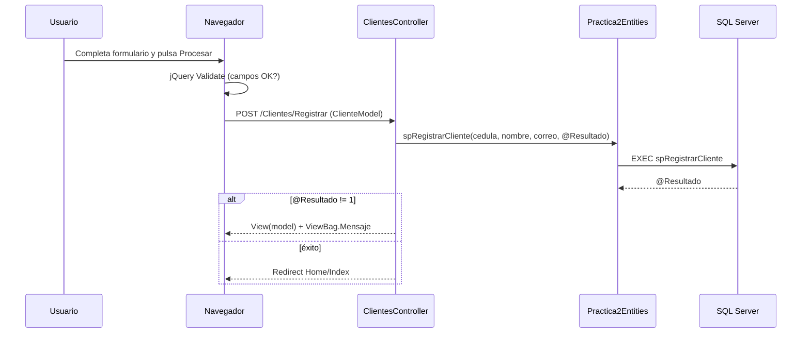

# Guía de aprendizaje — Práctica 2: Clientes y Mascotas

Esta guía explica **qué hace el proyecto**, **cómo está organizado** y **por qué** se tomaron ciertas decisiones técnicas. Está pensada para que un estudiante pueda repasar la práctica sin depender solo del código fuente.

**Importante:** todo lo descrito en las secciones 2–8 corresponde a **código real** en `Practica2.Web/`, no a diseños pendientes. La sección 0 resume qué archivos existen y qué queda fuera de alcance.

---

## 0. Inventario de implementación (auditoría)

| Componente | Archivo(s) | Estado |
|------------|------------|--------|
| Página de inicio | `Controllers/HomeController.cs`, `Views/Home/Index.cshtml` | Implementado |
| Registro de clientes (GET/POST) | `Controllers/ClientesController.cs`, `Views/Clientes/Registrar.cshtml` | Implementado |
| Registro de mascotas (GET/POST) | `Controllers/MascotasController.cs`, `Views/Mascotas/Registrar.cshtml` | Implementado |
| Consulta de mascotas (SP) | `MascotasController.Consultar`, `Views/Mascotas/Consultar.cshtml` | Implementado |
| ViewModels | `Models/ClienteModel.cs`, `MascotaModel.cs`, `ConsultaMascotaModel.cs` | Implementado |
| Entity Framework 6 (Database First) | `EF/Model1.edmx`, `Model1.Context.cs`, entidades generadas | Implementado |
| Stored procedures | `Practica2_StoredProcedures.sql` (spRegistrarCliente, spRegistrarMascota, spConsultarMascotas, spRegistrarError) | Implementado |
| Validación jQuery | `Scripts/registrar-cliente.js`, `Scripts/registrar-mascota.js` | Implementado |
| Layout + menú lateral | `Views/Shared/_Layout.cshtml`, `Content/site.css` | Implementado |
| Manejo de errores | try/catch en controladores, `Views/Shared/Error.cshtml`, `UtilitarioService` → `spRegistrarError` / `tbError` | Implementado |
| Reglas de negocio en servidor | Cédula única, cliente activo, máx. 2 mascotas/especie | Implementado en SPs y controladores |

**No implementado** (mencionado solo como ideas futuras en la sección 10):

- Validación servidor de campos vacíos con `[Required]` / `ModelState.IsValid` (hoy depende de jQuery + columnas `NOT NULL` en SQL).
- Pantalla para dar de baja clientes (`Estado = false`).
- Pruebas unitarias automatizadas.

---

## 1. ¿Qué es este proyecto y qué problema resuelve?

Imagina una clínica veterinaria que necesita un sistema sencillo para:

- Guardar datos de **dueños** (clientes): cédula, nombre y correo.
- Registrar **mascotas** vinculadas a cada dueño: nombre, especie, raza y peso.
- **Consultar** un listado de todas las mascotas con la información del dueño.

El problema de negocio no es solo “guardar datos en una tabla”. Hay **reglas**:

1. No puede haber dos clientes con la misma cédula.
2. Solo se pueden registrar mascotas para clientes **activos**.
3. Un mismo cliente no puede tener más de **2 mascotas de la misma especie** (por ejemplo, máximo 2 perros).
4. Todos los campos de los formularios son **obligatorios**.

La solución es una aplicación web **ASP.NET MVC 5** que separa responsabilidades en capas: interfaz (Views), lógica (Controllers), modelos de pantalla (ViewModels) y persistencia (Entity Framework 6 + SQL Server).

---

## 2. Arquitectura MVC paso a paso

**MVC** significa *Model–View–Controller* (Modelo–Vista–Controlador). Cada pieza tiene un rol claro:

| Letra | Significado | En este proyecto |
|-------|-------------|------------------|
| **M** | Model | Datos que viajan entre capas: `ClienteModel`, `MascotaModel`, entidades EF |
| **V** | View | Páginas HTML generadas con Razor (`.cshtml`) |
| **C** | Controller | Clases que reciben peticiones HTTP y deciden qué hacer |

### Flujo general

```
Usuario → URL → RouteConfig → Controller → (EF/SQL) → View → HTML al navegador
```

1. El usuario escribe una URL, por ejemplo `/Clientes/Registrar`.
2. **RouteConfig** interpreta `{controller}/{action}` y llama a `ClientesController.Registrar()`.
3. El **controlador** invoca stored procedures o consultas EF según la operación.
4. Devuelve una **vista** Razor que se convierte en HTML.
5. El navegador muestra la página y ejecuta JavaScript de validación.

La ruta por defecto está en `App_Start/RouteConfig.cs`:

```12:16:Practica2.Web/App_Start/RouteConfig.cs
            routes.MapRoute(
                name: "Default",
                url: "{controller}/{action}/{id}",
                defaults: new { controller = "Home", action = "Index", id = UrlParameter.Optional }
            );
```

Esto significa que `/` abre `HomeController.Index`, y `/Mascotas/Consultar` abre `MascotasController.Consultar`.

---

## 3. Cómo funciona cada capa

### 3.1 Controllers (controladores)

Los controladores son el “cerebro” de cada pantalla. Hay tres:

| Controlador | Responsabilidad |
|-------------|-----------------|
| `HomeController` | Página de bienvenida |
| `ClientesController` | Alta de clientes |
| `MascotasController` | Alta y consulta de mascotas |

Patrón usado en todos: **try/catch**, registro de error con `UtilitarioService`, y retorno de `View("Error")` si algo falla.

Ejemplo mínimo en Home:

```13:25:Practica2.Web/Controllers/HomeController.cs
        [HttpGet]
        public ActionResult Index()
        {
            try
            {
                return View();
            }
            catch (Exception ex)
            {
                utilitario.RegistrarErrorBitacora(ex.Message, "Index", 0);
                return View("Error");
            }
        }
```

- `[HttpGet]` indica que la acción responde a peticiones GET (abrir la página).
- `[HttpPost]` se usa cuando el formulario envía datos (POST).

### 3.2 Models / ViewModels

En `Models/` **no** están las entidades de base de datos. Son **ViewModels**: objetos adaptados a lo que la vista necesita mostrar o recibir del formulario.

**ClienteModel** — solo los campos del formulario de registro:

```3:8:Practica2.Web/Models/ClienteModel.cs
    public class ClienteModel
    {
        public string Cedula { get; set; }
        public string Nombre { get; set; }
        public string Correo { get; set; }
    }
```

**MascotaModel** — incluye además una lista para el dropdown de clientes:

```6:14:Practica2.Web/Models/MascotaModel.cs
    public class MascotaModel
    {
        public string Nombre { get; set; }
        public string Especie { get; set; }
        public string Raza { get; set; }
        public decimal Peso { get; set; }
        public long IdCliente { get; set; }
        public IEnumerable<SelectListItem> Clientes { get; set; }
    }
```

**ConsultaMascotaModel** — proyección de solo lectura para la tabla de consulta (no edita, solo muestra).

**¿Por qué separar ViewModel de entidad EF?**  
La entidad `Clientes` tiene `IdCliente`, `Estado`, relación con `Mascotas`, etc. El formulario de registro no necesita todo eso. Separar capas evita acoplar la UI al esquema de BD.

### 3.3 Views (vistas Razor)

Las vistas viven en `Views/{NombreControlador}/{Accion}.cshtml`.

Características importantes:

- `@model` declara el tipo de datos que recibe la vista.
- `Layout = "~/Views/Shared/_Layout.cshtml"` reutiliza menú y estilos.
- `Html.BeginForm` genera el `<form>` con action y method correctos.
- `Html.TextBoxFor(m => m.Cedula)` crea un input ligado al modelo.
- `@section scripts` carga jQuery y validación al final de la página.

El layout define el **menú lateral** con las tres opciones del enunciado y el mensaje de bienvenida:

```25:44:Practica2.Web/Views/Shared/_Layout.cshtml
                        <li class="sidebar-title">Menú</li>
                        <li class="sidebar-item">
                            <a href="@Url.Action("Registrar", "Clientes")" class="sidebar-link">
                                ...
                                <span>Registro de Clientes</span>
                            </a>
                        </li>
                        ...
                        <li class="sidebar-item">
                            <a href="@Url.Action("Consultar", "Mascotas")" class="sidebar-link">
                                ...
                                <span>Consulta de Mascotas</span>
                            </a>
                        </li>
```

### 3.4 Entity Framework (Database First + EDMX)

**Entity Framework 6 Database First** genera el modelo desde la base de datos `Practica2` mediante un archivo **EDMX** (`EF/Model1.edmx`), siguiendo el patrón del curso.

- **Contexto:** `Practica2Entities` en `EF/Model1.Context.cs` — puerta de entrada a la BD.
- **DbSet:** `Clientes`, `Mascotas`, `tbError`.
- **Entidades:** clases parciales en `EF/` generadas desde el EDMX.
- **SPs importados:** `spRegistrarCliente`, `spRegistrarMascota`, `spConsultarMascotas`, `spRegistrarError`.

La conexión usa formato **EntityClient** con metadatos embebidos en el ensamblado:

```xml
<add name="Practica2Entities"
     connectionString="metadata=res://*/EF.Model1.csdl|res://*/EF.Model1.ssdl|res://*/EF.Model1.msl;provider=System.Data.SqlClient;provider connection string=&quot;...&quot;"
     providerName="System.Data.EntityClient" />
```

El contexto lanza `UnintentionalCodeFirstException` en `OnModelCreating` porque el mapeo vive en el EDMX, no en código Fluent API.

La relación **1 cliente → N mascotas** se modela en el EDMX y corresponde a `FK_Mascotas_Clientes` del script `Database script.sql`.

Los scripts SQL auxiliares están en `Practica2_StoredProcedures.sql` (tabla `tbError` + procedimientos almacenados).

### 3.5 Scripts (validación en el navegador)

Antes de que el formulario llegue al servidor, **jQuery Validation** comprueba campos obligatorios y formatos.

Ejemplo en registro de cliente (`Scripts/registrar-cliente.js`):

- `Cedula`, `Nombre`, `Correo`: obligatorios.
- `Correo`: debe ser email válido.
- Mensajes en español: *"Campo obligatorio."*

En el **servidor**, las **reglas de negocio** (cédula duplicada, cliente activo, límite de mascotas) viven en los SPs `spRegistrarCliente` y `spRegistrarMascota`; el controlador solo interpreta el parámetro `@Resultado`. Los campos obligatorios del formulario se validan en el **navegador** con jQuery; si alguien desactiva JavaScript, la BD rechazaría un `INSERT` con valores nulos gracias a las columnas `NOT NULL`, pero no hay comprobación explícita de campos vacíos en C#.

### 3.6 Servicios

`UtilitarioService` centraliza el registro de errores llamando al SP `spRegistrarError`, que inserta en la tabla `tbError`:

```csharp
using (var context = new Practica2Entities())
{
    context.spRegistrarError(mensaje, lugar, usuario);
}
```

Los controladores invocan `utilitario.RegistrarErrorBitacora(...)` en los bloques `catch`; nunca llaman al SP directamente.

---

## 4. Reglas de negocio con código de referencia

### 4.1 Cédula única (no repetida)

Al registrar un cliente, se invoca `spRegistrarCliente`. El SP devuelve `@Resultado = -1` si la cédula ya existe; el controlador muestra el mensaje genérico de error.

### 4.2 Cliente activo para registrar mascota

Solo clientes con `Estado == true` aparecen en el dropdown (consulta LINQ en `ObtenerClientesActivos`). Al procesar el POST, `spRegistrarMascota` valida de nuevo que el `IdCliente` exista y esté activo; devuelve `@Resultado = -2` si falla.

**Doble validación:** la UI filtra inactivos, pero el SP comprueba por si alguien altera el `IdCliente` enviado.

### 4.3 Máximo 2 mascotas de la misma especie por cliente

`spRegistrarMascota` cuenta mascotas de la misma especie para el cliente; si hay 2 o más, devuelve `@Resultado = -3`. El controlador muestra el mensaje genérico cuando `resultado != 1`.

La comparación de `Especie` en el SP es **exacta** (mayúsculas/minúsculas importan según lo guardado).

### 4.4 Todos los campos obligatorios

| Capa | Mecanismo | ¿Implementado? |
|------|-----------|------------------|
| Cliente (navegador) | jQuery: `required` + `email` en correo | Sí — `Scripts/registrar-cliente.js` |
| Mascota (navegador) | jQuery: `required`, `number`, `min: 0.01` en peso | Sí — `Scripts/registrar-mascota.js` |
| Servidor (reglas de negocio) | Cédula única, cliente activo, límite por especie | Sí — SPs `spRegistrarCliente` / `spRegistrarMascota` |
| Servidor (campos vacíos) | `[Required]` / `ModelState` | **No** — ver sección 10 |
| BD | Columnas `NOT NULL` en script SQL | Sí — `Database script.sql` |

### 4.5 Consulta de mascotas

El controlador invoca `spConsultarMascotas()` (JOIN en SQL) y proyecta el resultado a `ConsultaMascotaModel`:

```78:86:Practica2.Web/Controllers/MascotasController.cs
                    var lista = (from R in context.spConsultarMascotas()
                                 select new ConsultaMascotaModel
                                 {
                                     CedulaCliente = R.CedulaCliente,
                                     NombreCliente = R.NombreCliente,
                                     NombreMascota = R.NombreMascota,
                                     Especie = R.Especie,
                                     Peso = R.Peso
                                 }).ToList();
```

La vista muestra el peso con dos decimales: `@item.Peso.ToString("0.00")`.

### 4.6 ViewBag para mensajes de error

`ViewBag` es un diccionario dinámico del controlador a la vista. En Razor:

```22:25:Practica2.Web/Views/Clientes/Registrar.cshtml
                if (ViewBag.Mensaje != null)
                {
                    <div class="alert text-danger" role="alert">@ViewBag.Mensaje</div>
                }
```

No forma parte del modelo fuerte (`ClienteModel`); es metadata de la respuesta (mensaje puntual).

---

## 5. Flujo de una petición HTTP

### 5.1 Registro de cliente (POST)



Pasos en código:

1. **GET** `Registrar()` → vista vacía con `new ClienteModel()`.
2. Usuario rellena y envía.
3. **POST** `Registrar(ClienteModel model)` → `spRegistrarCliente` → si `@Resultado == 1`, redirect; si no, mensaje de error.

El SP inserta con `Estado = 1` y devuelve `@Resultado = -1` si la cédula ya existe.

### 5.2 Registro de mascota (POST)

1. **GET** `Registrar()` → `CargarModeloRegistro(0)` llena el dropdown (LINQ a `Clientes` activos).
2. Usuario elige cliente, especie, etc.
3. **POST** → `spRegistrarMascota` (valida cliente activo y límite por especie en SQL) → si `@Resultado == 1`, **redirect a Consultar**.

```57:57:Practica2.Web/Controllers/MascotasController.cs
                    return RedirectToAction("Consultar");
```

Tras registrar una mascota, el usuario ve de inmediato el listado actualizado.

---

## 6. Conceptos clave explicados

### LINQ y stored procedures

**LINQ** se usa para consultas simples en C# (p. ej. dropdown de clientes activos). Los altas y la consulta de mascotas usan **SPs importados en el EDMX** (`spRegistrarCliente`, `spRegistrarMascota`, `spConsultarMascotas`), invocados desde el contexto EF con `ObjectParameter` para parámetros de salida.

### ViewBag

Contenedor dinámico para pasar datos extra a la vista (mensajes, flags). No requiere cambiar la clase del modelo. Desventaja: sin IntelliSense ni validación de nombres en compilación.

### jQuery Validate

Plugin que lee reglas del objeto `rules` en JavaScript y muestra errores antes del POST. Se combina con `@Scripts.Render("~/bundles/jqueryval")` definido en `BundleConfig`.

### Clave foránea (FK)

`Mascotas.IdCliente` **debe** existir en `Clientes.IdCliente`. La BD rechaza un INSERT con `IdCliente` inválido. La regla de “cliente activo” se aplica en el dropdown (LINQ) y en `spRegistrarMascota` (SQL).

### `using (var context = new Practica2Entities())`

El bloque `using` garantiza que el contexto EF se **dispose** al salir, liberando conexiones. Buena práctica en acciones cortas de MVC.

### RedirectToAction vs return View

- **Redirect:** nueva petición GET (patrón Post-Redirect-Get); evita reenviar formulario al refrescar.
- **View:** misma petición; se usa cuando hay errores de validación y hay que mostrar el formulario otra vez con datos.

---

## 7. Base de datos (recordatorio)

Script en `Database script.sql`:

| Tabla | Columnas principales |
|-------|---------------------|
| `Clientes` | IdCliente (PK, identity), Cedula, Nombre, Correo, Estado (bit) |
| `Mascotas` | IdMascota (PK), Nombre, Especie, Raza, Peso (decimal 8,2), IdCliente (FK) |

Relación: **1:N** — un cliente, muchas mascotas.

---

## 8. Qué debería entender el estudiante al terminar

Después de estudiar este proyecto, deberías poder explicar:

1. **Qué hace MVC** y qué archivo tocar para cambiar la UI vs la lógica vs la BD.
2. **Por qué hay ViewModels** además de entidades EF.
3. **Cómo fluye una petición** desde la URL hasta la invocación de SPs o consultas EF.
4. **Dónde vive cada regla de negocio** (cédula única, 2 mascotas/especie, cliente activo — en los SPs).
5. **Diferencia entre validación cliente (jQuery)** y **servidor (SPs + controlador)**.
6. **Qué es LINQ** y cuándo se usa frente a stored procedures importados en el EDMX.
7. **Para qué sirve ViewBag** y cuándo usar redirect después de un POST.
8. **Cómo se relacionan las tablas** con FK y cómo EF modela esa relación.

---

## 9. Verificación realizada en este entorno

Comprobaciones ejecutadas al auditar el repositorio (junio 2026):

| Prueba | Resultado | Cómo comprobarlo |
|--------|-----------|------------------|
| BD `Practica2` en localhost | Existe | `sqlcmd -S localhost -E -Q "SELECT name FROM sys.databases WHERE name = 'Practica2'"` |
| Tablas `Clientes`, `Mascotas`, `tbError` | Presentes | Scripts `Database script.sql` + `Practica2_StoredProcedures.sql` |
| SPs (`spRegistrarCliente`, etc.) | Presentes | `Practica2_StoredProcedures.sql` |
| FK `FK_Mascotas_Clientes` | Presente | Definida en el script SQL |
| Compilación `Practica2.Web.sln` (MSBuild Debug) | Sin errores | MSBuild genera `Practica2.Web.dll` |
| Código fuente de pantallas y reglas | Implementado | Ver sección 0 |

La base de datos estaba vacía (0 clientes, 0 mascotas), lo cual es normal antes de las pruebas manuales en el navegador (F5 en Visual Studio).

---

## 10. Próximos pasos de aprendizaje (opcional)

- Añadir **Data Annotations** (`[Required]`, `[EmailAddress]`) en ViewModels para validación servidor automática con `ModelState.IsValid`.
- Implementar **baja lógica** de clientes (`Estado = false`) desde una pantalla de administración.
- Escribir **pruebas unitarias** para las reglas de negocio en los SPs.

---

*Guía elaborada para apoyar el estudio de ASP.NET MVC 5, Entity Framework 6 y SQL Server en el contexto de la Práctica 2.*
